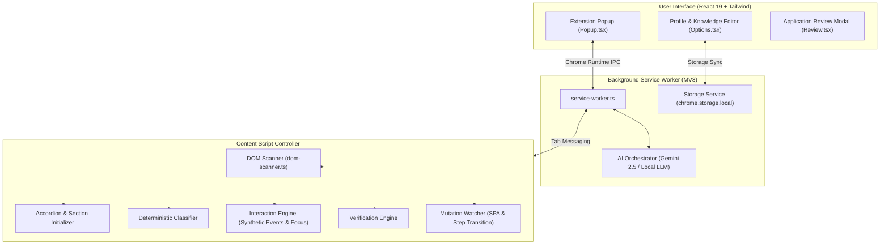

# 🚀 AI Job Application Assistant

> **A high-performance Chrome Extension (Manifest V3) powered by Google Gemini and Local AI for real-time, deterministic, and autonomous job application autofilling.**

[](https://developer.chrome.com/docs/extensions/mv3/intro/)
[](https://www.typescriptlang.org/)
[](https://react.dev/)
[](https://tailwindcss.com/)
[](https://vitest.dev/)

---

## 🌟 Highlights & Key Capabilities

- ⚡ **Universal ATS Compatibility**: Fully supports enterprise ATS platforms, including **Workday**, **SAP SuccessFactors** (`sapsf.com`), **TalentRecruit** (Angular Material SPAs), **Greenhouse**, **Lever**, **Taleo**, **BambooHR**, **Microsoft Forms**, **Google Forms**, and custom company career portals.
- 🔄 **Autonomous Accordion & Repeater Expander**: Automatically detects and expands closed accordion bars (e.g., `Profile Information`, `Employment Details`, `Formal Education`, `Language Skills`, `Job-Specific Information`) and triggers `(+) Add` buttons to render input fields into the DOM on modern dynamic portals before scanning and filling.
- 🧠 **Real-Time AI Agent with Memory Bank**: Answers custom or open-ended application questions in real-time, strictly grounded on candidate resume evidence. Every generated answer is automatically saved to the profile's **Q&A Knowledge Bank** for instant zero-latency reuse in future applications.
- 🗂️ **Multi-CV & Profile Management**: Create, switch, edit, and delete multiple tailored CV profiles (e.g. *Full Stack Developer*, *Generative AI Specialist*, *Engineering Manager*). Includes full **JSON Export** and **JSON Import** for easy profile backup and migration.
- 💾 **Zero-Loss Storage Persistence**: Deep integration with `chrome.storage.local` ensures profiles, custom Q&As, and field mappings survive extension reloads, browser restarts, and tab navigation without data loss.
- 🛡️ **Safety & Security First**: Automatically detects CAPTCHA challenges, OTP verifications, and sensitive password/financial inputs, immediately pausing automation to hand control back to the user.
- 🔍 **Hybrid Classification Pipeline**: Combines an ultra-fast deterministic regex/heuristics engine with Google Gemini for high-accuracy field classification and resume parsing.
- 🎯 **Multi-Frame Iframe Aggregation**: Scans top-level documents, accessible same-origin iframes, and cross-origin subframes, aggregating fields without race conditions or frame overwrites.

---

## 🛠️ System Architecture



---

## 📋 Supported Field Types

| Category | Supported Semantic Fields |
| :--- | :--- |
| **Personal Identity** | Full Name, First Name, Last Name, Salutation (`Mr.`, `Ms.`, `Dr.`), Email, Phone / Mobile, Phone Device Type, Phone Extension |
| **Location & Address** | Street Address, City, State / Province, Zip / Postal Code, Country |
| **Professional Experience** | Current Job Title / Designation, Current Employer / Company, Start Date, End Date, Currently Work Here checkbox, Job Responsibilities Description, Total Years of Experience |
| **Education & Academia** | Institution / University / College, Degree Level, Major / Field of Study, Graduation / Completion Date, GPA / Grade |
| **Work Preferences** | Desired / Current Salary, Notice Period (days), Work Authorization, Visa Sponsorship Status |
| **Links & Socials** | LinkedIn, GitHub, Portfolio Website, Personal Site |
| **Skills & Languages** | Tag / Chip Inputs, Comma-delimited Skills, Language Fluency & Proficiency levels |
| **Custom Q&A** | Open-ended text areas, radio questions, multi-choice dropdowns, and custom ATS questions answered via Gemini AI |

---

## 🚀 Quick Start & Installation

### 1. Prerequisites
- **Node.js** (v18.0.0 or higher)
- **npm** (v9.0.0 or higher)
- **Google Chrome** (or any Chromium browser like Brave, Edge, Opera)

### 2. Clone the Repository
```bash
git clone https://github.com/mohd98zaid/chrome-autofill-extension-ai.git
cd chrome-autofill-extension-ai
```

### 3. Install Dependencies
```bash
npm install
```

### 4. Build the Extension
```bash
npm run build
```
This bundles the project using Vite into the `dist/` directory.

### 5. Load the Extension into Chrome
1. Open Google Chrome and navigate to:
   ```
   chrome://extensions
   ```
2. Enable **Developer mode** using the toggle in the top-right corner.
3. Click the **Load unpacked** button in the top-left.
4. Select the **`dist`** folder inside the cloned project directory (`auto-fill-ext/dist`).
5. Pin the **AI Job Application Assistant** to your Chrome toolbar.

---

## ⚙️ Configuration & Usage

### 1. Setting up your Profile
1. Click the extension icon in your Chrome toolbar.
2. Click **Edit Profile** (or right-click extension icon > **Options**).
3. Fill in your identity, contact details, experiences, education, and skills.
4. *(Optional)* Paste your raw Resume/CV in the **Import from Resume** modal to automatically populate your profile using Gemini AI.
5. *(Optional)* Add your **Google Gemini API Key** under Settings for instant AI question generation.

### 2. Autofilling an Application
1. Navigate to any job application portal (e.g. Workday, SAP SuccessFactors, Greenhouse, TalentRecruit, LinkedIn).
2. Open the extension popup:
   - The extension will automatically scan and detect form fields on the page.
   - For accordion-based portals (like SAP SuccessFactors), the extension automatically expands closed panels and triggers `(+) Add` buttons.
3. Select your desired CV profile from the dropdown if you have multiple saved profiles.
4. Click **Fill Application Now**:
   - Fields are filled and verified with real synthetic keyboard and mouse events.
   - Any unknown application questions are answered via AI and saved to your **Q&A Knowledge Bank**.

### 3. Exporting & Importing Profiles
- Use the **Export JSON** button in the popup to back up your full profile including saved Q&A pairs.
- Use the **Import JSON** button to load your profile on any machine in one click.

---

## 🧪 Testing & Verification

The project includes unit and integration tests using **Vitest** covering DOM scanning, classification rules, storage persistence, and AI response parsing:

```bash
# Run unit & integration tests
npm test

# Run TypeScript type-checking
npm run type-check

# Run production build
npm run build
```

---

## 📁 Project Structure

```
├── manifest.json                  # Manifest V3 extension configuration
├── src/
│   ├── background/                # Chrome Service Worker
│   │   ├── ai/                    # Gemini API adapter & local LLM orchestrator
│   │   └── service-worker.ts      # Multi-tab session & message controller
│   ├── content/                   # Injected content scripts
│   │   ├── classifier/            # Deterministic regex & taxonomy classifier
│   │   ├── interaction/           # DOM interaction engine (native setters & custom selects)
│   │   ├── jd/                    # Job description extractor
│   │   ├── mutation/              # MutationObserver watcher for SPAs & wizards
│   │   ├── scanner/               # DOM scanner, Shadow DOM & iframe traverser
│   │   ├── verification/          # Post-fill input verifier
│   │   └── content-script.ts      # Main content controller
│   ├── options/                   # Options / Profile Editor page (React)
│   ├── popup/                     # Browser Action Popup UI (React)
│   ├── review/                    # Fill verification & review modal
│   ├── storage/                   # StorageService wrapper for chrome.storage.local
│   ├── types/                     # TypeScript definitions, taxonomy, & Zod schemas
│   └── utils/                     # Structured logger & text helpers
├── tests/                         # Vitest test suites
├── vite.config.ts                 # Vite bundler configuration for UI & background
├── vite.content.config.ts         # Vite configuration for content script
└── vitest.config.ts               # Test configuration
```

---

## 🛡️ Privacy & Security

- **Local-First Storage**: Your resumes, personal contact info, and credentials are stored strictly in your browser's private `chrome.storage.local`.
- **No Telemetry / No Tracking**: No personal data is sent to external telemetry servers.
- **Direct AI Queries**: When AI assistance is used, requests are sent directly to the official Google Gemini API using your personal API key over HTTPS.
- **Human-in-the-Loop**: High-risk fields (passwords, credit cards, SSN, OTPs) are never auto-submitted.

---

## 📄 License

This project is licensed under the [MIT License](LICENSE).
